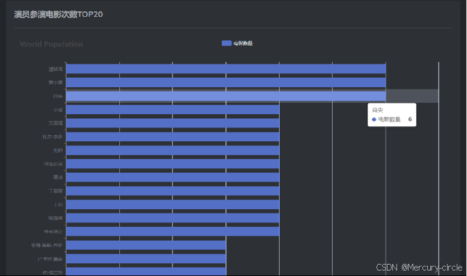

# 电影数据分析可视化平台实现
## 系统概述
本系统面向电影行业从业者的是电影数据分析平台，为电影行业的从业者（如制片人、导演、营销人员等）提供深入的电影舆情分析数据，帮助他们更好地理解和把握市场动态。提供多维度的分析结果，包括热门电影、热门话题、演员热度以及对评分起伏的电影进行预警等。支持数据可视化展示，便于快速理解市场趋势。用户可以选择关注自己在意的影片，获取影片最新的数据分析报告，满足不同业务需求。

### 系统的功能性需求

### 系统的非功能性需求
系统的非功能性需求即反映了系统的质量要求和性能要求，如系统的稳定性、易用性等。本文系统的非功能性需求主要集中在稳定性、易用性，详情如下。

系统的稳定性。它主要体现在舆情爬虫模块的爬虫任务稳定性。确保系统能够长期稳定运行，定期的持续获取所需数据。

系统的易用性。提供用户友好的界面和操作流程。简洁明了的用户界面，提供直观的数据展示和查询功能。提高用户体验，使用户能够轻松地使用系统进行数据查看和分析。

## 用户界面与体验设计
参考图

产出图

伸缩与自适应情况

## 功能实现
数据采集，数据源之一：最近热门电影，页面更新频率是一周更新一次。

数据采集，存入.csv文件

存入数据库

数据源2：正在上映的

## 页面记录
业务逻辑实现样例，登录与注册页面。
流程如下：

业务逻辑实现，面向电影制作人的页面：首页、搜索、影库数据分析（时间分析、评分分析、地区分析、导演与演员分析）、词云（评论词云图、标题词云图、简介词云图、演员名词词云图）。

①首页默认显示的为“最热电影”，面向从业者，需要关注的为一手消息。当前最热门的电影种类为剧情片，除此之外显示了热门电影的个数、最高评分、出场最多演员、制片国家等数据。各类表主要使用echarts.js制作。

点击电影名称跳转到预告片页面，点击海报显示海报大图。

②搜索：默认显示热门电影数据库中排名第一的数据。

输入关键词，电影标题如果包含关键字，会形成列表渲染到页面，页面包含电影基础信息。

影库数据分析：主要包含四种分析表。评分分析表：可以根据电影类型看到该类型电影最多评分分布在哪一范围，可以切换为柱状图，也可以观测数据文本视图。

④词云图：评论词云图，输入关键词或者电影全称，显示该电影对应的词云，标题词云图、简介词云图、演员名词词云图还在写后端逻辑。

